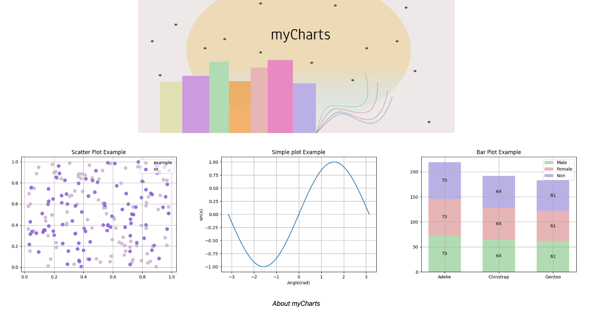

# NTUA ECE SAAS 2023 PROJECT
  
## TEAM (saas2023-44)
  
Περιγραφή - οδηγίες
  
Περιέχονται φάκελοι για 15 microservices. Ο αριθμός είναι εντελώς ενδεικτικός. Δημιουργήστε ακριβώς όσα απαιτούνται από τη λύση σας.

## MyCharts

At myCharts we have one mission, to provide you with quality charts so you can describe, explain, demonstrate and analyze your data with no extra effort.So, what are you waiting for?

## Architecture

A Visual Paradigm File can be found [here](/architecture/).

## Requirements

* Node v19.5.0
* Java 17.0.2
* Docker 4.8.2
* Python 3.10.8

## Installation

* ./init.sh
* docker network create --subnet=10.0.1.0/24 mycharts-network (skip if already exists)
* docker compose up

## Notes

This project contains .env files with basic configuration.

  
  
  
