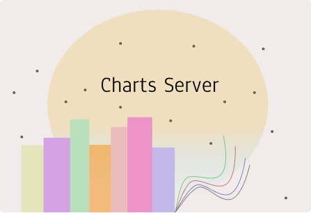

# MICROSERVICE10

## My Charts Simple Plot Storage Server

Microservice10 consists of two parts, the API for myCharts simple plot storage service, and a consumer that consumes messages, from an exchange, that contain the chart, stores it under storage folder and creates a record in a mysql database.

