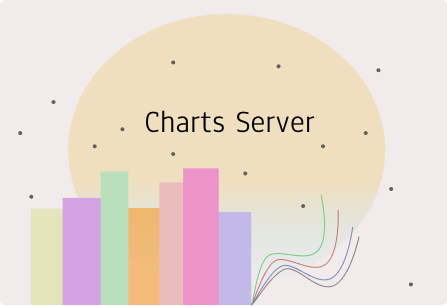

# MICROSERVICE11

## My Charts Scatter Plot Storage Server

Microservice11 consists of two parts, the API for myCharts scatter plot storage service, and a consumer that consumes messages, from an exchange, that contain the chart, stores it under storage folder and creates a record in a mysql database.

