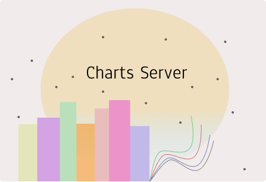

# MICROSERVICE13

## My Charts Bar Plot Storage Server

Microservice13 consists of two parts, the API for myCharts bar plot storage service, and a consumer that consumes messages, from an exchange, that contain the chart, stores it under storage folder and creates a record in a mysql database.
